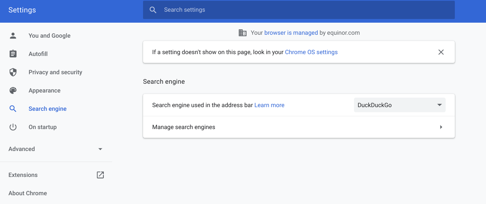
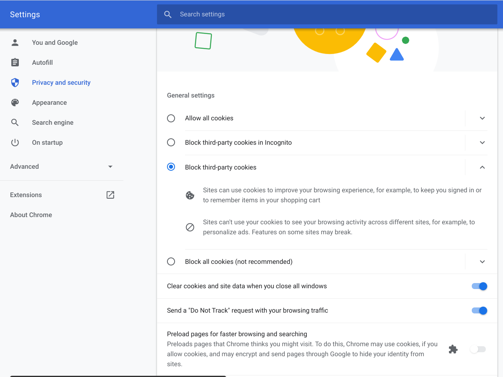
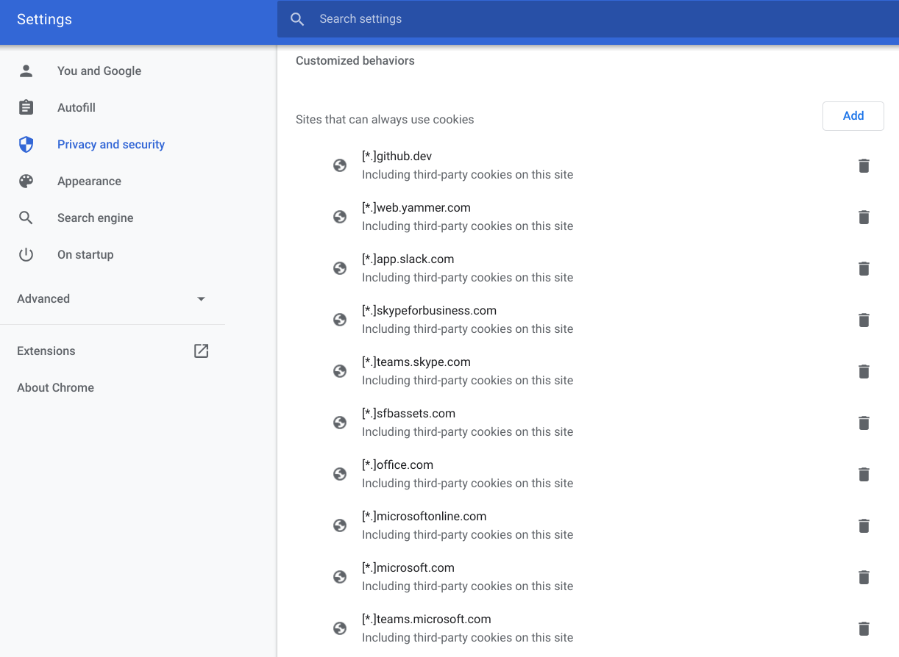
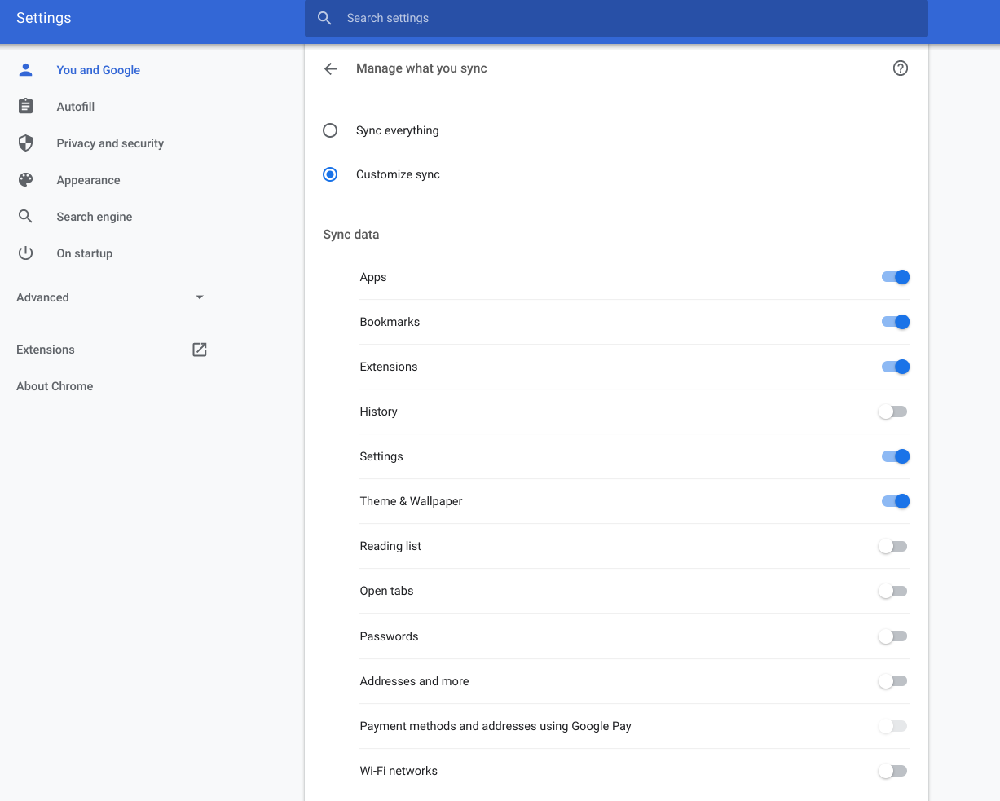

# Privacy related topics

This document gather information related to privacy protecting features, running a chromebook. Seems like a paradox, using ChromeOS/Chrome from Google and protecing our privacy - however, we should not give away our signals because we are using ChromeOS. Thus I hope you will help gather information to tweak the system to send as few as signals as possible.

## Extensions

- [EFF Privacy Badger](https://www.eff.org/pages/privacy-badger)
- [DuckDuckGo Privacy Essentials](https://chrome.google.com/webstore/detail/duckduckgo-privacy-essent/bkdgflcldnnnapblkhphbgpggdiikppg)

## Browser settings

Change your default search engine, what cookies you allow and what you synch in your google profile.

### Search Engine.

Make DuckDuckGo your default search engine.

### Cookies

Open up for most used sites (at work), to allow for cookies. This to make certain features to work, e.g. MS Teams.

#### Cookie list

##### Equinor

- [*.]equinor.com
- [*.]statoil.com
- [*.]equinor.service-now.com

##### Github/Codespaces

- [*.]github.com
- [*.]github.dev
- [*.]vscode.dev
- [*.]vscode-webview.net

##### Google

- accounts.google.com

##### Teams/Office/Sharepoint

- [*.]login.live.com
- [*.]teams.microsoft.com
- [*.]microsoft.com
- [*.]microsoftonline.com
- [*.]office.com
- [*.]sharepoint.com

### Manage what you synch

