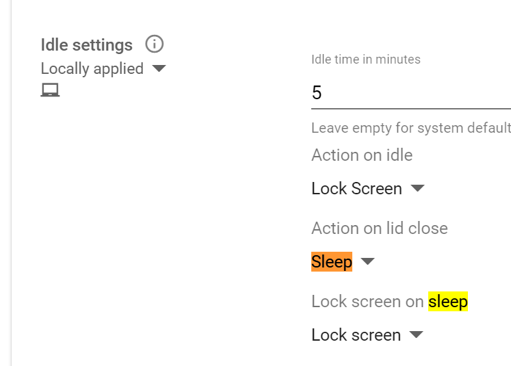

# Policy changes - management of Chromebook devices

## 7th November 2021

|What/Where|Reasoning|Info|
|:----|:--------|:---|
|Show lock screen when waking from sleep. [User & Browser settings](https://admin.google.com/ac/chrome/settings/user) - Section: Security-> Idle settings. `Lock screen on sleep.` changed to `Lock screen`. Was `Allow user to configure.`|Enforce the device is locked if in idle modus. Locks the device if the user closes the lid and opens it.||
