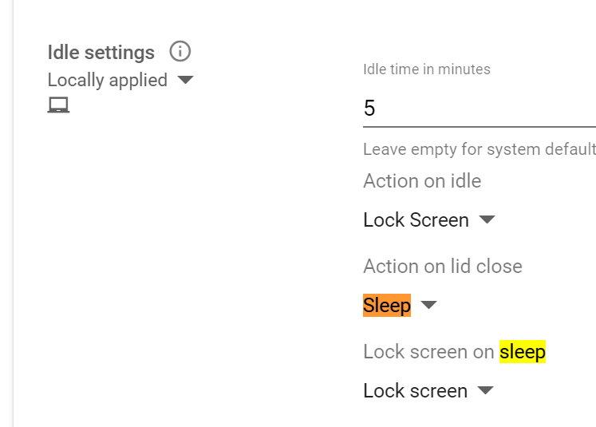
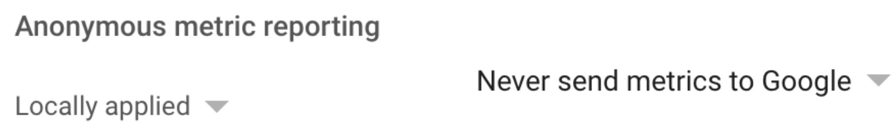
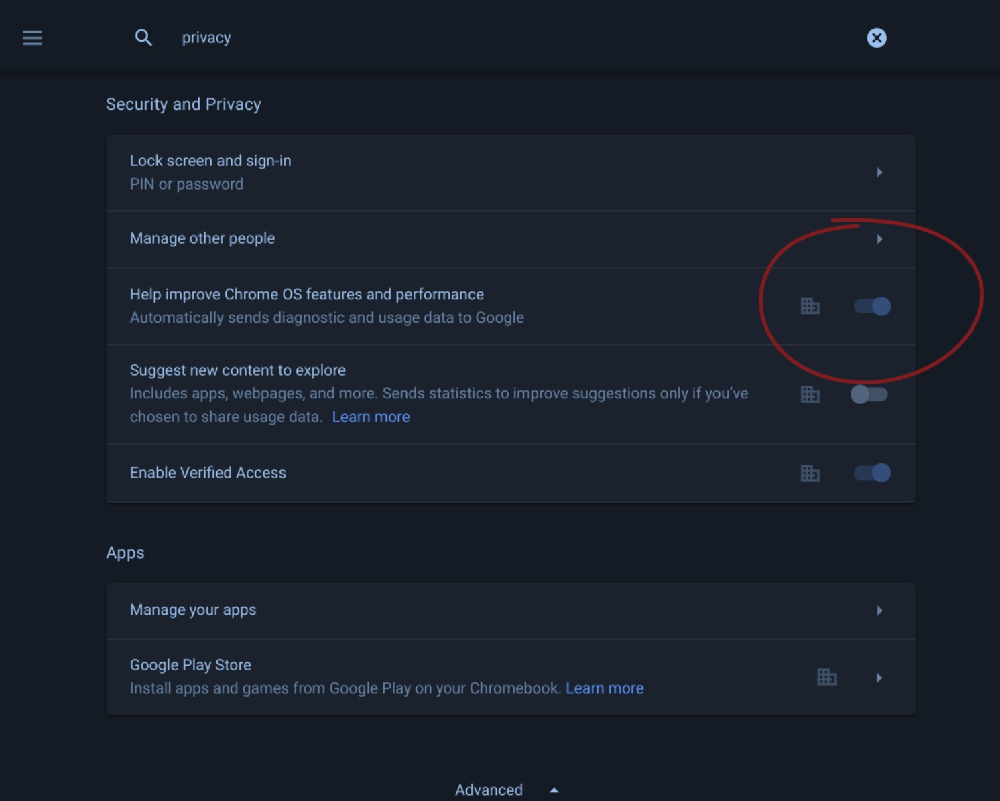
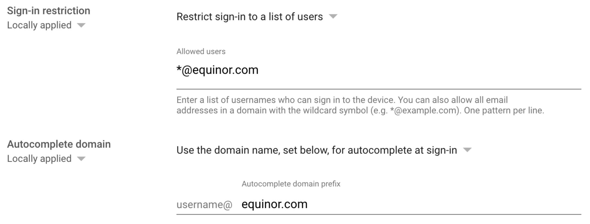
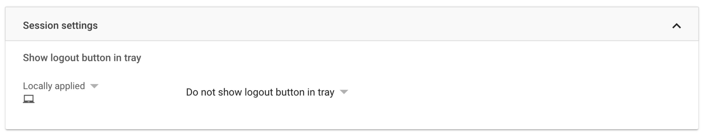
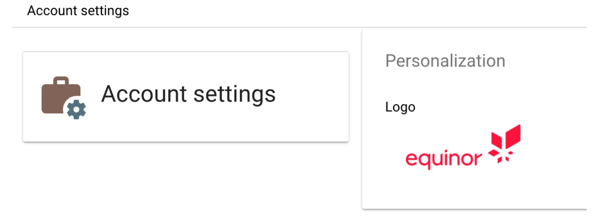
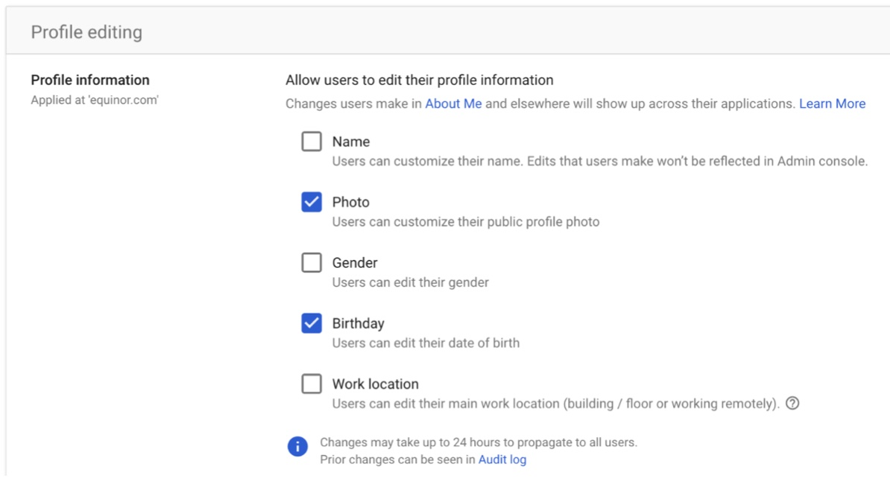

# Policy changes - management of Chromebook devices

## 7th November 2021

|What/Where|Reasoning|Info|
|:----|:--------|:---|
|Show lock screen when waking from sleep. [User & Browser settings](https://admin.google.com/ac/chrome/settings/user) - Section: Security-> Idle settings.|Enforce the device is locked if in idle modus. Locks the device if the user closes the lid and opens it.||

## 21st October 2021

|What/Where|Reasoning|Info|
|:----|:--------|:---|
|Disable sending user/device data to google. [Device Settings](https://admin.google.com/ac/chrome/settings/device) - Section: “User and Device reporting”|Protect privacy - do not sending these signals/reports to google.||
|Enable only accepting users/login with @equinor address. Device Settings - Section: [“Sign-in settings”](https://admin.google.com/ac/chrome/settings/device)|Only users with an @equinor account should be able to sign-in to our google managed system.||
|Do not show logout button in tray. User & Browser settings - section [“Session settings”](https://admin.google.com/ac/chrome/settings/user).|The sign-out button occupies space in the tray, which is not necessary as sign-out button is found in the 'settings'-pane.||
|Equinor account logo. Account Settings - section [“Perszonalisations - Logo”](https://admin.google.com/ac/accountsettings).|Show company logo upper right for the Google Account. (e.g. in G Drive page)||
|Enable possibility to change user profile picture. [Directory Settings - Section “Profile Editing”](https://admin.google.com/ac/directory/profileediting)|Allow users to change their profile image Does not interfer with AZ AD - aka sending it back / update AZ AD.||

---