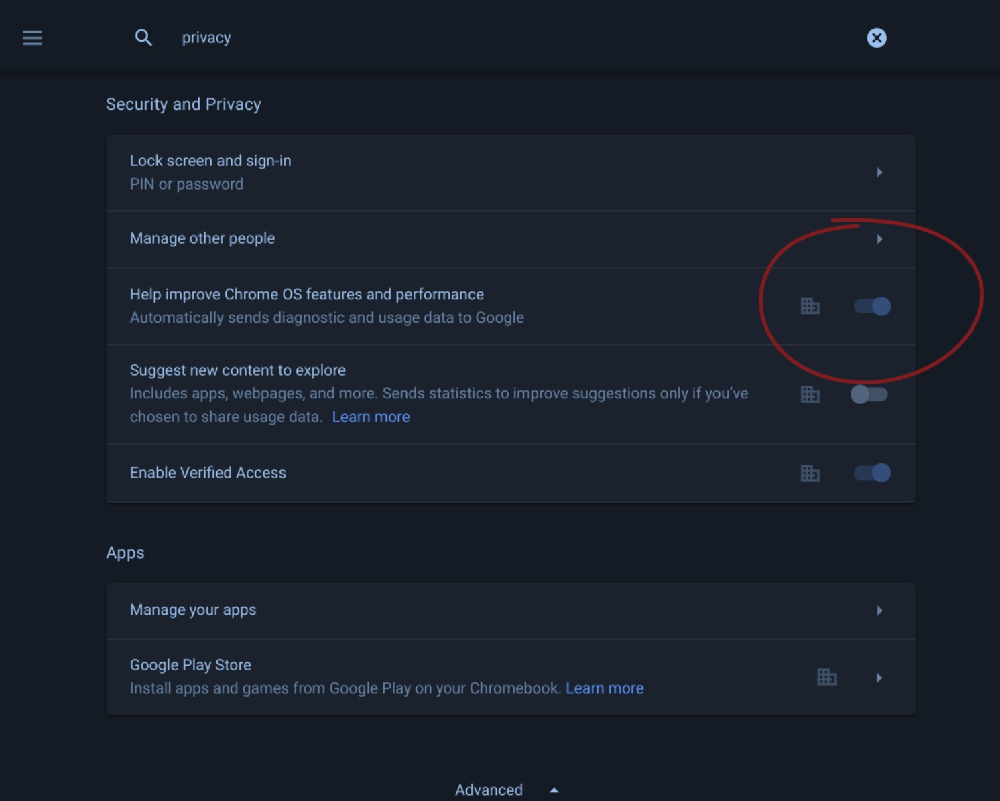
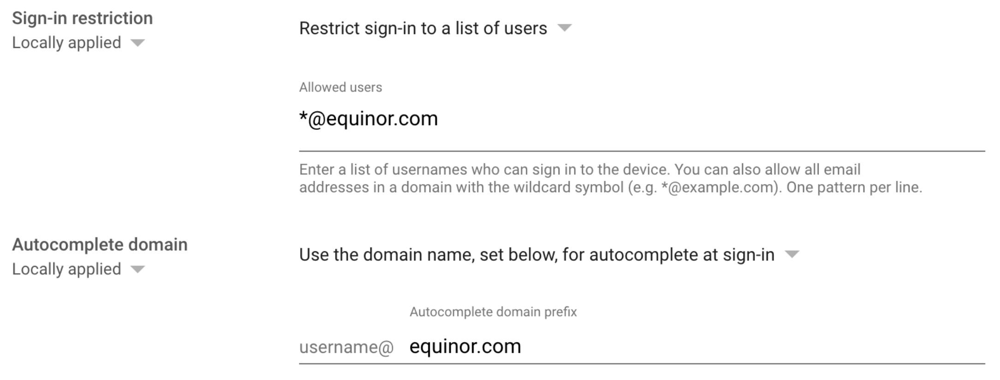

# Cahanges in management of devices

|Where|Reasoning|Info|
|:----|:--------|:---|
|Disable sending user/device data to google. [Device Settings](https://admin.google.com/ac/chrome/settings/device) - Section: “User and Device reporting”|Protect privacy for the users - by not sending these signals/reports to google.||
|Enable only accepting users/login with @equinor address. Device Settings - Section: [“Sign-in settings”](https://admin.google.com/ac/chrome/settings/device)|Only users with an @equinor account should be able to sign-in to our google managed system.||

---